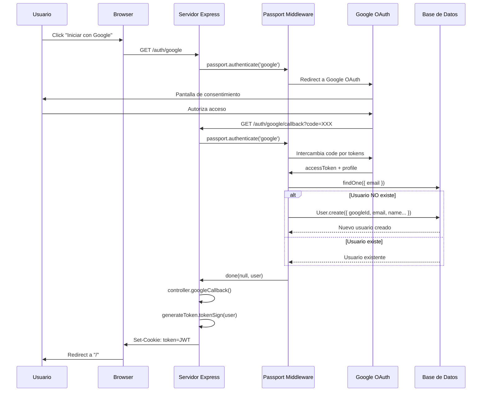
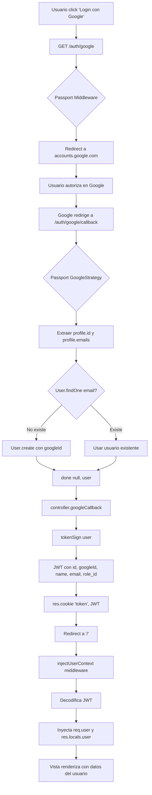

# Flujo de Autenticación con Google OAuth 2.0

## Descripción General

El sistema implementa autenticación con Google OAuth 2.0 usando la estrategia `passport-google-oauth20`. El flujo permite a los usuarios iniciar sesión con su cuenta de Google sin necesidad de crear una contraseña local.

---

## Diagrama de Flujo



---

## Arquitectura de Componentes

```
┌─────────────────────────────────────────────────────────────────────┐
│                           FLUJO DE AUTENTICACIÓN                    │
├─────────────────────────────────────────────────────────────────────┤
│                                                                     │
│  ┌──────────────┐    ┌──────────────────┐    ┌─────────────────┐   │
│  │   RUTAS      │───▶│   MIDDLEWARE     │───▶│   CONTROLADOR   │   │
│  │ auth.routes  │    │   passport.js    │    │ auth.controller │   │
│  └──────────────┘    └──────────────────┘    └─────────────────┘   │
│         │                    │                        │             │
│         │                    ▼                        ▼             │
│         │           ┌──────────────────┐    ┌─────────────────┐    │
│         │           │   Google OAuth   │    │  generateToken  │    │
│         │           │   API Externa    │    │    (JWT)        │    │
│         │           └──────────────────┘    └─────────────────┘    │
│         │                    │                        │             │
│         ▼                    ▼                        ▼             │
│  ┌─────────────────────────────────────────────────────────────┐   │
│  │                     BASE DE DATOS (MySQL)                    │   │
│  │                     Modelo: User (google_id)                 │   │
│  └─────────────────────────────────────────────────────────────┘   │
│                                                                     │
└─────────────────────────────────────────────────────────────────────┘
```

---

## Rutas de Autenticación

**Archivo:** `src/routes/auth.routes.js`

| Método | Ruta | Descripción |
|--------|------|-------------|
| `GET` | `/auth/google` | Inicia el flujo OAuth con Google |
| `GET` | `/auth/google/callback` | Callback de Google con código de autorización |
| `GET` | `/auth/logout` | Cierra sesión eliminando la cookie JWT |

### Configuración de Rutas

```javascript
// Inicia flujo OAuth - solicita permisos de profile y email
router.get('/auth/google',
  passport.authenticate('google', { scope: ['profile', 'email'] })
);

// Callback de Google - procesa respuesta sin sesiones
router.get('/auth/google/callback',
  passport.authenticate('google', {
    session: false,              // No usa sesiones de Express
    failureRedirect: '/auth/login'
  }),
  controller.googleCallback      // Genera JWT y setea cookie
);
```

---

## Middleware Passport

**Archivo:** `src/middleware/passport.js`

### Estrategia Google OAuth 2.0

```javascript
passport.use(new GoogleStrategy({
    clientID: process.env.GOOGLE_CLIENT_ID,
    clientSecret: process.env.GOOGLE_CLIENT_SECRET,
    callbackURL: '/auth/google/callback'
  },
  async (accessToken, refreshToken, profile, done) => {
    // Lógica de verificación/creación de usuario
  }
));
```

### Flujo de la Estrategia

1. **Recibe datos de Google:**
   - `accessToken`: Token de acceso (no se almacena)
   - `refreshToken`: Token de refresco (no se almacena)
   - `profile`: Datos del usuario de Google

2. **Busca usuario por email:**
   ```javascript
   let user = await User.findOne({
     where: { email: profile.emails[0].value }
   });
   ```

3. **Crea usuario si no existe:**
   ```javascript
   user = await User.create({
     name: profile.name.givenName || profile.displayName,
     lastname: profile.name.familyName || '',
     email: profile.emails[0].value,
     role_id: 2,           // Rol por defecto: usuario
     googleId: profile.id  // ID único de Google
   });
   ```

4. **Retorna usuario al controlador:**
   ```javascript
   return done(null, user);
   ```

---

## Middleware de Autenticación

**Archivo:** `src/middleware/auth.js`

### `injectUserContext`

Middleware global que inyecta el usuario en cada request si existe un JWT válido.

```
Request → Verificar Cookie → Decodificar JWT → Inyectar en req.user/res.locals.user
```

| Propiedad | Descripción |
|-----------|-------------|
| `req.user` | Datos del usuario para uso en controladores |
| `res.locals.user` | Datos del usuario disponibles en vistas EJS |

### Flujo del Middleware

```javascript
const injectUserContext = async (req, res, next) => {
    const token = req.cookies?.token;

    res.locals.user = null;
    req.user = null;

    if (!token) { return next(); }  // Sin token, continúa

    try {
        const decoded = await verifyToken(token);
        if (decoded) {
            res.locals.user = decoded;  // Para vistas EJS
            req.user = decoded;         // Para controladores
        }
    } catch (error) {
        res.clearCookie('token');       // Token inválido, limpia cookie
    }
    next();
};
```

---

## Controlador de Autenticación

**Archivo:** `src/controllers/auth.controller.js`

### `googleCallback`

Procesa el callback exitoso de Google y genera el JWT.

```javascript
controller.googleCallback = async (req, res) => {
    try {
        // req.user viene del middleware passport
        const token = await generateToken.tokenSign(req.user);

        res.cookie('token', token, {
            httpOnly: true,      // No accesible desde JavaScript
            secure: false,       // true en producción (HTTPS)
            sameSite: 'lax',     // Protección CSRF
            maxAge: 60 * 60 * 1000  // 1 hora
        });

        return res.redirect('/');
    } catch (error) {
        return res.redirect('/');
    }
};
```

### `logout`

Cierra sesión eliminando la cookie del JWT.

```javascript
controller.logout = (req, res) => {
    res.clearCookie('token');
    return res.redirect('/');
};
```

---

## Generación de Token JWT

**Archivo:** `src/utils/generateToken.js`

### Estructura del Payload

```javascript
const tokenSign = async (user) => {
    return jwt.sign(
        {
            id: user.id,           // ID interno de la DB
            googleId: user.googleId || null,
            name: user.name,
            email: user.email,
            role_id: user.role_id || "",
        },
        process.env.JWT_SECRET,
        { expiresIn: "2h" }
    );
}
```

### Datos Almacenados en JWT

| Campo | Descripción | Origen |
|-------|-------------|--------|
| `id` | ID del usuario en DB | `users.id` |
| `googleId` | ID único de Google | `users.google_id` |
| `name` | Nombre del usuario | Google profile |
| `email` | Email del usuario | Google profile |
| `role_id` | ID del rol | `users.role_id` |

---

## Modelo de Usuario

**Archivo:** `src/database/models/user.js`

### Campos Relevantes para OAuth

```javascript
User.init({
    id: {
        type: DataTypes.INTEGER,
        primaryKey: true,
        autoIncrement: true
    },
    googleId: {
        type: DataTypes.STRING,
        allowNull: true,
        field: 'google_id',  // Mapeo snake_case en DB
    },
    name: { type: DataTypes.STRING },
    lastname: { type: DataTypes.STRING },
    email: { type: DataTypes.STRING },
    role_id: { type: DataTypes.BIGINT },
    // ... timestamps
});
```

### Características del Modelo

- **Paranoid mode:** Soft deletes con `deleted_at`
- **Timestamps:** `createdAt`, `updatedAt` automáticos
- **Campo googleId:** Nullable para usuarios con login tradicional

---

## Almacenamiento de Datos

### 1. Base de Datos (Persistente)

```
┌─────────────────────────────────────────────────────┐
│                    Tabla: users                     │
├─────────────────────────────────────────────────────┤
│ id          │ INT        │ PK, Auto-increment       │
│ google_id   │ VARCHAR    │ ID único de Google       │
│ name        │ VARCHAR    │ Nombre (de Google)       │
│ lastname    │ VARCHAR    │ Apellido (de Google)     │
│ email       │ VARCHAR    │ Email verificado         │
│ role_id     │ BIGINT     │ FK a roles (default: 2)  │
│ created_at  │ DATETIME   │ Fecha de registro        │
│ updated_at  │ DATETIME   │ Última actualización     │
│ deleted_at  │ DATETIME   │ Soft delete (nullable)   │
└─────────────────────────────────────────────────────┘
```

### 2. Cookie JWT (Local/Temporal)

```
┌─────────────────────────────────────────────────────┐
│                  Cookie: token                      │
├─────────────────────────────────────────────────────┤
│ Nombre:    token                                    │
│ Valor:     eyJhbGciOiJIUzI1NiIs... (JWT)           │
│ httpOnly:  true (no accesible desde JS)            │
│ secure:    false (true en producción)              │
│ sameSite:  lax                                      │
│ maxAge:    3600000 (1 hora)                        │
│ Expira:    2 horas (definido en JWT)               │
└─────────────────────────────────────────────────────┘
```

### Contenido del JWT Decodificado

```json
{
  "id": 1,
  "googleId": "123456789012345678901",
  "name": "Juan",
  "email": "juan@gmail.com",
  "role_id": 2,
  "iat": 1706745600,
  "exp": 1706752800
}
```

---

## Variables de Entorno Requeridas

```env
# Google OAuth 2.0
GOOGLE_CLIENT_ID=tu-client-id.apps.googleusercontent.com
GOOGLE_CLIENT_SECRET=tu-client-secret

# JWT
JWT_SECRET=tu-secreto-jwt-seguro
```

---

## Diagrama de Secuencia Detallado



---

## Consideraciones de Seguridad

1. **httpOnly cookie:** Previene acceso desde JavaScript (XSS)
2. **sameSite: lax:** Protección básica contra CSRF
3. **JWT firmado:** Integridad verificable con `JWT_SECRET`
4. **No se almacenan tokens de Google:** Solo se usa el `profile.id`
5. **Expiración dual:** Cookie (1h) y JWT (2h)

### Mejoras Recomendadas para Producción

- Cambiar `secure: true` en cookies (requiere HTTPS)
- Implementar refresh tokens para sesiones largas
- Agregar rate limiting en rutas de autenticación
- Validar el dominio del email si se requiere
